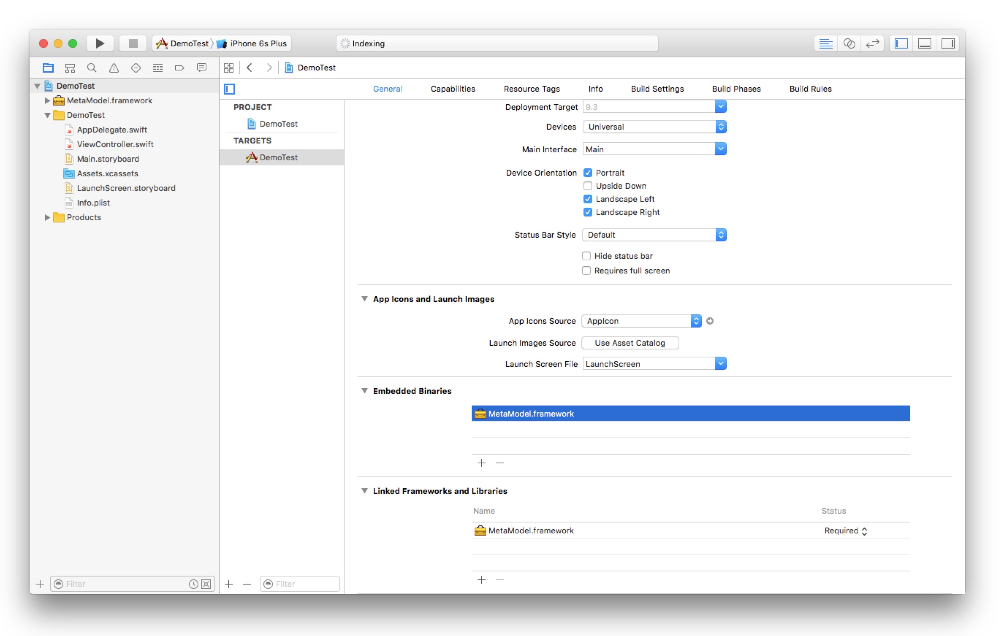

# MetaModel

[](https://github.com/draveness/metamodel/blob/master/LICENSE)
[](http://rubygems.org/gems/metamodel)

MetaModel is an iOS framework that includes everything about model layer, data persistent, JSON to model constructor and a bunch of APIs which provides a way of dealing with client side database very easily.

> MetaModel is under-development, API may constantly change before gets to 1.0.0.

+ [x] Fastest JSON to model API
+ [x] Dealing with database without writing SQL
+ [x] Most concise API to retrieve data from persistent level

Use a meta file to define your model:

```ruby
define :User do |j|
  # define User model like this
  j.nickname :string
  j.avatar :string
  j.email :string, :unique, default: "default@gmail.com"
end
```

And then run `meta build` will automatically generate all the code you need.

## Installation

```
sudo gem install metamodel --verbose
```

**System Requirements**: Current version of MetaModel requires macOS with Ruby 2.2.2 or above

## Quick Start

After installation , run `meta init` in your iOS project root folder which will make a `meta` directory in current folder.

```shell
$ cd /path/to/project
$ meta init

Initialing MetaModel project

Creating `meta` folder for MetaModel
```

Generate your model meta file with `meta generate`.

```shell
$ meta generate User

Generating model meta file

-> Adding `user.rb` to meta folder

[!] `user.rb` has already generated, use the command below to edit it.

  vim meta/user.rb
```

Edit meta file using vim, Emacs or other editor and run `meta build`.

```shell
$ meta build

Building MetaModel project

Cloning MetaModel project into `./MetaModel` folder
Using `./MetaModel/MetaModel.xcodeproj` to build module

Analyzing meta files
-> Resolving `user.rb`

Generating model files
-> Using User.swift file
```

This command create a brand new xcode project in `./MetaModel` folder, just add the `MetaModel.project` into your project or workspace. And add `MetaModel.framework` to **Linked frameworks and Libraries** phrase which located in `General` tab.



Add this line of code in your project.

```swift
import MetaModel
```


## License

This project is licensed under the terms of the MIT license. See the [LICENSE](./LICENSE) file.

The MIT License (MIT)

Copyright (c) 2016 Draveness

Permission is hereby granted, free of charge, to any person obtaining a copy
of this software and associated documentation files (the "Software"), to deal
in the Software without restriction, including without limitation the rights
to use, copy, modify, merge, publish, distribute, sublicense, and/or sell
copies of the Software, and to permit persons to whom the Software is
furnished to do so, subject to the following conditions:

The above copyright notice and this permission notice shall be included in all
copies or substantial portions of the Software.

THE SOFTWARE IS PROVIDED "AS IS", WITHOUT WARRANTY OF ANY KIND, EXPRESS OR
IMPLIED, INCLUDING BUT NOT LIMITED TO THE WARRANTIES OF MERCHANTABILITY,
FITNESS FOR A PARTICULAR PURPOSE AND NONINFRINGEMENT. IN NO EVENT SHALL THE
AUTHORS OR COPYRIGHT HOLDERS BE LIABLE FOR ANY CLAIM, DAMAGES OR OTHER
LIABILITY, WHETHER IN AN ACTION OF CONTRACT, TORT OR OTHERWISE, ARISING FROM,
OUT OF OR IN CONNECTION WITH THE SOFTWARE OR THE USE OR OTHER DEALINGS IN THE
SOFTWARE.
