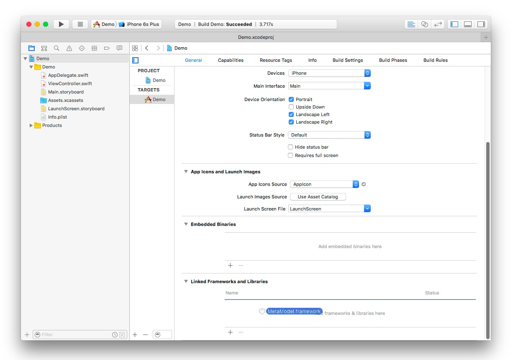
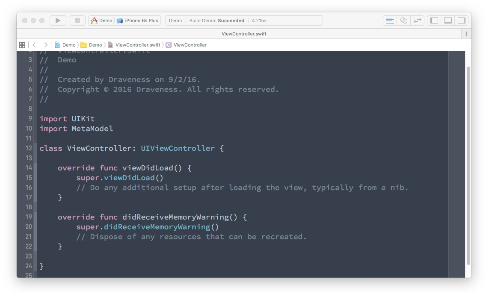

# MetaModel

[](https://github.com/draveness/metamodel/blob/master/LICENSE)
[](http://rubygems.org/gems/metamodel)

MetaModel is an iOS framework designed to help developer to deal with data persistent, JSON parsing and a bunch of APIs which provides an approach of handling client side database very easily.

> MetaModel is under-development, API may constantly change before gets to 1.0.0.

+ [x] Dealing with database without writing SQL
+ [x] Most concise API to retrieve data from persistent level
+ [ ] Fastest JSON to model API

MetaModel provides convenience chainable APIs to manipulate models like ActiveRecord.

```swift
let json = ["id": 1, "name": "Buzz", "email": "i@metamodel.info"]
let person = Person.parse(json)

// INSERT INTO "people" (id, name, email) VALUES (1, "Buzz", "i@metamodel.info")
person.save

// SELECT "people".* FROM "people" WHERE "people"."id" = 1 LIMIT 1
if var person = Person.find(1) {
    // UPDATE "people" SET "people"."name") = "Buzz" WHERE "people"."id" = 1
    person.update(name: "Draven")
}

// SELECT "people".* FROM "people"
print(Person.all)
```

## Usage

Use Metafile in project folder to define your model:

```ruby
metamodel_version '0.1.0'

define :Article do
  attr :title
  attr :content

  has_many :comments
end

define :Comment do
  attr :content

  belongs_to :article
end
```

And then run `meta build` will automatically generate all the code you need.

## Installation

```
sudo gem install metamodel --verbose
```

## Quick Start

After installation , run `meta init` in your iOS project root folder which will make a `meta` directory in current folder.

```shell
$ cd /path/to/project
$ meta init

Initialing MetaModel project

Creating `Metafile` for MetaModel
```

Generate your model meta file with `meta generate`.

```shell
$ meta generate Article

Generating model meta file

-> Adding `Article` model to Metafile

[!] Adding `Article` model scaffold to Metafile, use the command below to edit it.

  vim Metafile
```

Edit meta file using vim, Emacs or other editor and run `meta build`.

```shell
$ meta build

Building MetaModel.framework in project
  Existing project `./metamodel/MetaModel.xcodeproj`

Analyzing Metafile
  -> Resolving `Article`
  -> Resolving `Comment`

Generating model files
  -> Using Article.swift file
  -> Using Comment.swift file

[!] Please drag MetaModel.framework into Embedded Binaries phrase.
```

This command build a `MetaModel.framework` in project root folder, you need to add this framework to **Embedded Binaries** phrase which located in `General` tab.



Add this line of code in your project.

```swift
import MetaModel
```



## License

This project is licensed under the terms of the MIT license. See the [LICENSE](./LICENSE) file.

The MIT License (MIT)

Copyright (c) 2016 Draveness

Permission is hereby granted, free of charge, to any person obtaining a copy
of this software and associated documentation files (the "Software"), to deal
in the Software without restriction, including without limitation the rights
to use, copy, modify, merge, publish, distribute, sublicense, and/or sell
copies of the Software, and to permit persons to whom the Software is
furnished to do so, subject to the following conditions:

The above copyright notice and this permission notice shall be included in all
copies or substantial portions of the Software.

THE SOFTWARE IS PROVIDED "AS IS", WITHOUT WARRANTY OF ANY KIND, EXPRESS OR
IMPLIED, INCLUDING BUT NOT LIMITED TO THE WARRANTIES OF MERCHANTABILITY,
FITNESS FOR A PARTICULAR PURPOSE AND NONINFRINGEMENT. IN NO EVENT SHALL THE
AUTHORS OR COPYRIGHT HOLDERS BE LIABLE FOR ANY CLAIM, DAMAGES OR OTHER
LIABILITY, WHETHER IN AN ACTION OF CONTRACT, TORT OR OTHERWISE, ARISING FROM,
OUT OF OR IN CONNECTION WITH THE SOFTWARE OR THE USE OR OTHER DEALINGS IN THE
SOFTWARE.
